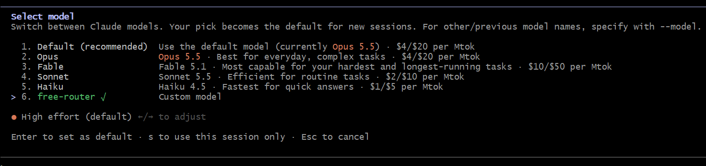

# Unified Free Model Proxy for Cline & Claude CLI

A zero-dependency Node.js proxy server that routes OpenAI-compatible requests (**Cline**) and Anthropic Messages requests (**Claude CLI / Claude Code**) to **OpenRouter free-tier models** with automatic failover, SWE-first prioritization, and multi-batch recovery.

<p align="center">
  
</p>

---

## Why Use This?

- **Zero Dropped Agent Loops**: Automatically intercepts rate limits (`429`) or server overloads (`503`) and cascades to the next best free model without breaking agent workflows.
- **Dual Protocol Support**: Exposes both `/v1/chat/completions` (OpenAI format for Cline) and `/v1/messages` (Anthropic format with native SSE streaming for Claude Code).
- **Bypasses 3-Model Limits**: OpenRouter limits fallback arrays to 3 models per request; this proxy seamlessly handles 10+ models across sequential multi-batch retries.
- **Auto Mode Fast-Path**: Intercepts Claude Code's repetitive safety classifier checks (`claude-sonnet-5`), auto-approving in <20ms with 0 tokens to preserve free rate limits.
- **Zero External Dependencies**: Pure Node.js (v18+) using native `fetch` and streams—no `npm install` needed. Works identically on Windows, macOS, and Linux.

---

## Model Priority Cascades (SWE-First)

Prioritizes verified software-engineering benchmark leaders first, backed by 1M/512k context models:

| Priority | Model | Context | Specialty / Benchmark |
| :--- | :--- | :--- | :--- |
| **1** | `poolside/laguna-s-2.1:free` | 262k | **SWE Leader** (70.2% Terminal-Bench 2.1, 40.4% DeepSWE) |
| **2** | `cohere/north-mini-code:free` | 256k | Cohere agentic code specialist (30B MoE) |
| **3** | `nvidia/nemotron-3-ultra-550b-a55b:free` | 1,000,000 | Frontier reasoning foundation (550B MoE) |
| **4** | `nvidia/nemotron-3.5-lightning:free` | 1,000,000 | Fast low-latency reasoning MoE |
| **5** | `dots-studio/dots-3-note-preview:free` | 512k | Heavyweight coding MoE (280B MoE) |
| **6** | `poolside/laguna-xs-2.1:free` | 262k | Lightweight fast coding agent (33B MoE) |
| **7** | `qwen/qwen3.8-27b:free` | 262k | Dense syntax, reasoning & tool calling |
| **8** | `nvidia/nemotron-3-super-120b-a12b:free` | 262k | Heavyweight 120B MoE coder |
| **9** | `inclusionai/ling-3.0-flash-sante:free` | 262k | High-throughput fallback |
| **10** | `openrouter/free` | 200k | OpenRouter dynamic free auto-router |

*(For Cline, models are automatically chunked into 3-model batches. TokenHarbor free models like `deepseek-v4.1-flash:free` are also supported if configured).*

---

## 🤖 1-Prompt Autonomous Agent Setup

If using an AI coding agent (**Claude Code**, **Cline**, **Cursor**, **Antigravity**, **Roo Code**, etc.), paste this prompt into your agent to clone, install, configure, and launch the proxy automatically:

> **Agent Prompt:**
> 
> ```text
> Clone https://github.com/hissain/FreeModelsForCline.git, set up the .env file from .env.example, start the background proxy service, and configure my coding tool to use it.
> 
> Critical Decisions — Before proceeding, ask me:
> 1. What is my OpenRouter API Key (sk-or-v1-...)? (Required for OpenRouter free models; prompt me to input it so it can be saved to .env)
> 2. Which client should be configured: Claude Code, Cline, or both?
> 
> Once I provide those answers:
> - Save the API key to .env (and ensure PORT=8081).
> - Start the background proxy daemon using `node scripts/proxy.mjs start`.
> - Verify the service is healthy at http://localhost:8081/health.
> - Configure the requested client(s):
>   * Claude Code: Set ANTHROPIC_BASE_URL="http://localhost:8081" and ANTHROPIC_MODEL="free-router" in ~/.claude/settings.json or .claude/settings.local.json.
>   * Cline: Set Base URL to "http://localhost:8081/v1", Model ID to "free-router", and API Key to "dummy".
> - Run a test prompt through the client to confirm free-tier routing is functional.
> ```

---

## Manual Quick Start

### 1. Initialize Configuration
```bash
npm run init        # or: node scripts/proxy.mjs init
```
Add your key to `.env`:
```env
OPENROUTER_API_KEY=sk-or-v1-your-key-here
PORT=8081
SAFETY_CLASSIFIER_MODEL=auto-approve
```

### 2. Start the Proxy
```bash
npm run proxy:start # or: node scripts/proxy.mjs start
```
The server listens at `http://localhost:8081/v1`.

---

## Client Configurations

### 1. Claude CLI (Claude Code)
Add to `~/.claude/settings.json` (or `.claude/settings.local.json` in your project):

```json
{
  "env": {
    "ANTHROPIC_BASE_URL": "http://localhost:8081",
    "ANTHROPIC_AUTH_TOKEN": "dummy",
    "ANTHROPIC_API_KEY": "",
    "ANTHROPIC_MODEL": "free-router"
  },
  "permissions": {
    "allow": ["Bash(*)", "Read(*)", "Write(*)", "Edit(*)", "Glob(*)", "Grep(*)"]
  },
  "allowDangerouslySkipPermissions": true
}
```

- `ANTHROPIC_MODEL: "free-router"`: Triggers proxy auto-cascading across free models.
- `ANTHROPIC_API_KEY: ""`: Prevents unwanted browser login attempts to Anthropic.
- `SAFETY_CLASSIFIER_MODEL=auto-approve`: Bypasses Claude Code's background `claude-sonnet-5` permission checks in `<20ms`, saving 100% of classifier API calls.

Test Claude CLI:
```bash
claude -p "Say hello in 3 words"
```

### 2. Cline (VS Code)
In **Cline Settings** -> **API Provider**:
- **API Provider**: `OpenAI Compatible`
- **Base URL**: `http://localhost:8081/v1`
- **API Key**: `dummy`
- **Model ID**: `free-router`

---

## Background Service & Autostart

Managed via cross-platform Node CLI (`scripts/proxy.mjs`):

| Command | Action |
| :--- | :--- |
| `npm run proxy:start` | Start in background with auto-restart supervisor |
| `npm run proxy:stop` | Stop background proxy and supervisor |
| `npm run proxy:status` | Check health, port status, and recent log lines |
| `npm run proxy:restart` | Restart the proxy |
| `npm run autostart:install` | Register proxy to boot on user login (Windows/macOS/Linux) |
| `npm run autostart:uninstall` | Remove autostart registration |

### Autostart Implementation
- **Windows**: VBS script in `%APPDATA%\Microsoft\Windows\Start Menu\Programs\Startup`
- **macOS**: LaunchAgent plist in `~/Library/LaunchAgents`
- **Linux**: systemd user service in `~/.config/systemd/user`

---

## License

[MIT](LICENSE) © 2026 Md. Sazzad Hissain Khan

---

<p align="center">
  Made by Hissain with ❤️ for Developers
</p>